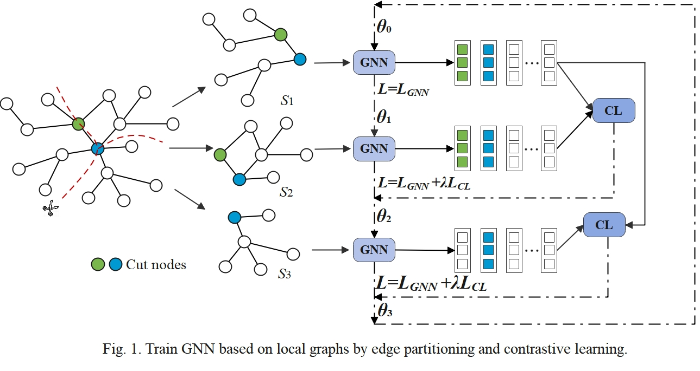
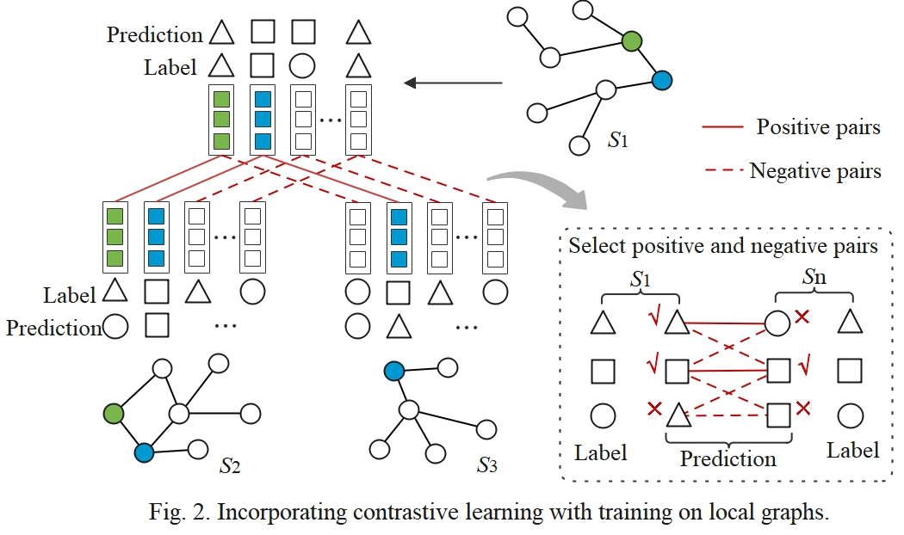
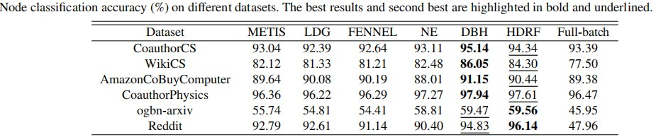
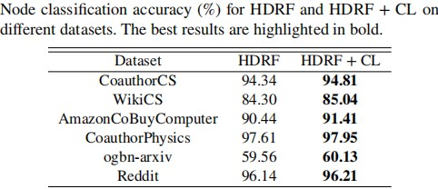

# LocalGNN
========

A PyTorch implementation of "LocalGNN" .
<p align="center">
   
</p>

### Results

<p align="center">
    
</p>

<p align="center">
   
</p>

### Requirements
The codebase is implemented in Python 3.8.12. package versions used for development are just below.
```
torch              1.12.1
ogb                1.3.6
dgl                0.9.1
numpy              1.21.2
pandas             2.0.3
torchmetrics       1.0.3
```

### Datasets
<p align="justify">
 AmazonCoBuyComputer, CoauthorCS, CoauthorPhysics,  WikiCS, and Reddit dataset are from the dgl repository. Ogbn-arxiv is from https://ogb.stanford.edu/docs/nodeprop/#ogbn-arxiv.</p>
 
### Graph Partitioning Algorithms
<p align="justify">
METIS, LDG, and FENNEL are provided by us in `util/li_Partitioner.py`. NE, DBH, and HDRF are from the original paper.


### Examples
<p align="justify">
The following commands learn a neural network and score on the test set. </p>

```sh
$ python LocalGNN/localgnn_node.py
```


----------------------

